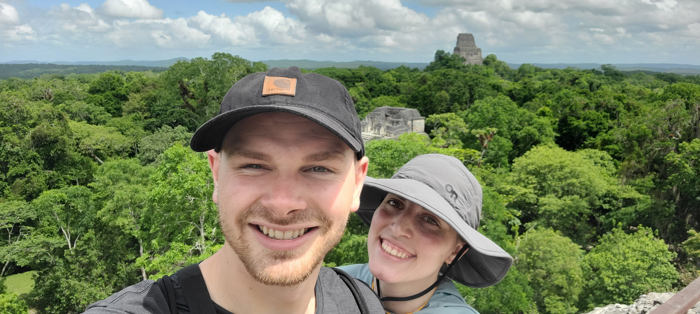

# Welcome

#### Welcome to my Portfolio! This page is intended to provide a broader insight into, and a unique and creative way of sharing, my professional and non-professional experiences; projects; interests; passions. 

